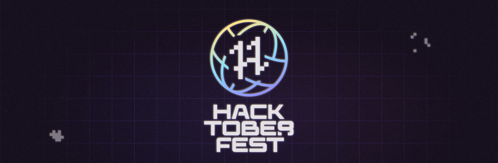

<h1 align="center">Awesome CSS Projects🎨🎭</h1>

    

 


[](https://github.com/irshadmd/Awesome-CSS-Projects/issues)
[](https://github.com/irshadmd/Awesome-CSS-Projects/network)
[](https://github.com/irshadmd/Awesome-CSS-Projects/stargazers)


[](https://hacktoberfest.com/)

<p align="center">
<br/>
Are you getting started with open-source contribution and want to dive deep?

</p>


<p align="center">
<br/>
Are you looking for some awesome CSS Projects in which each and every project will teach you an important CSS Concept?
<br/>
</p>


<p align="center">
Do you want to contribute to some Awesome CSS projects and showcase your CSS skills through it?🎨<br/>
</p>


<p align="center">
**So, What are you waiting for?**
<br/>

</p>

# Before you begin💻

We would request you to go through the contributing guidelines throughly so that you know what you are doing.

Little knowledge of Github would be benificial for you so that you know what you are doing.

# Tech-Stack🎓
  

# Contributing Guidelines📝

Are we missing any of your favorite features, which you think you can add to it? For major changes, please open an issue first to discuss what you would like to change. You are welcome to contribute in this project. Pull requests are welcome.

To start contributing, follow the below guidelines: 

**1.**  Fork [this](https://github.com/irshadmd/Awesome-CSS-Projects) repository.

**2.**  Clone your forked copy of the project.

```
git clone https://github.com/<your_user_name>/Awesome-CSS-Projects.git
```

**3.** Navigate to the project directory :file_folder: .

```
cd Awesome-CSS-Projects
```

**4.** Add a reference(remote) to the original repository.

```
git remote add upstream https://github.com/irshadmd/Awesome-CSS-Projects.git 
```

**5.** Check the remotes for this repository.

```
git remote -v
```

**6.** Always take a pull from the upstream repository to your master branch to keep it at par with the main project(updated repository).

```
git pull upstream main
```

**7.** Create a new branch.

```
git checkout -b <your_branch_name>
```

**8.** Perfom your desired changes to the code base.
> 1. create a folder and add all code in that folder only.
> 2. create a demo folder inside "Your Project" and add a gif of your project named demo.gif

**9.** Track your changes:heavy_check_mark: .

```
git add . 
```

**10.** Commit your changes .

```
git commit -m "Relevant message"
```

**11.** Push the committed changes in your feature branch to your remote repo.

```
git push -u origin <your_branch_name>
```

**12.** To create a pull request, click on `compare and pull requests`.

**13.** Add appropriate title and description to your pull request explaining your changes and efforts done.

**14.** Click on `Create Pull Request`.


**15.** Woohoo! You have made a PR to the Awesome-CSS-Projects :boom: . Wait for your submission to be accepted and your PR to be merged.

**Thank you for your interest in contributing to our Repo!🏼**

**Kudos to you🎈**

**Best of luck 👍😊**


# Our valuable Contributors👩‍💻👨‍💻 :
<a href="https://github.com/irshadmd/Awesome-CSS-Projects/graphs/contributors">
  
</a>
